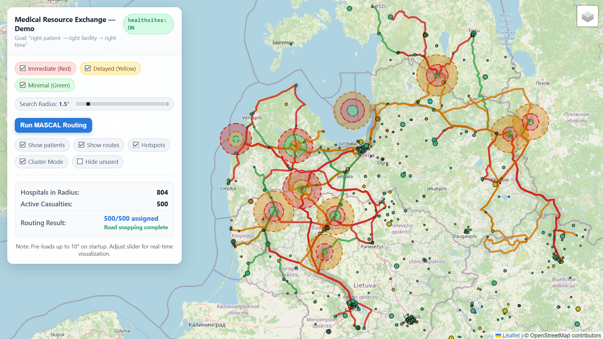

# Medical Crisis Routing Demo

Student-built prototype created for the NATO TIDE Hackathon 2026.

This project demonstrates a map-based medical crisis routing workflow for casualty-to-facility decision support. It combines healthcare facility map data with routing and assignment logic to help identify appropriate destinations based on location, accessibility, and available facility information.



## What it does

- Visualizes healthcare facilities on an interactive map
- Loads Healthsites map data from local shapefiles
- Supports casualty-to-facility routing workflows
- Demonstrates map-based decision support for medical crisis response
- Explores interoperability between open-source geospatial data and operational medical planning tools


## Data Setup

Create a folder called `map_data/` in the project root and place the Healthsites Europe export there.

Download from: https://healthsites.io/map?country=Europe  
(Download the **Shapefile** export, then extract it into `map_data/`.)

### Expected `map_data/` structure

The app expects **two shapefile datasets**: one for **nodes** and one for **ways**.  
Each dataset must include the standard shapefile sidecar files:

- `.shp` (geometry)
- `.shx` (shape index)
- `.dbf` (attributes)
- `.prj` (projection)
- `.cpg` (encoding)

Your folder should look like this:

```
map_data/
  Europe-node.shp
  Europe-node.shx
  Europe-node.dbf
  Europe-node.prj
  Europe-node.cpg

  Europe-way.shp
  Europe-way.shx
  Europe-way.dbf
  Europe-way.prj
  Europe-way.cpg

  LICENSE.txt
  README.md
```

> **Important:** The current code expects the base names to be exactly:
> `Europe-node.*` and `Europe-way.*` inside `map_data/`.
> If you download a different region or your filenames differ, rename them to match
> or update the filenames in the code/config accordingly.

### Notes on size / Git

The `.dbf` files can be very large (Europe exports can be ~1GB+). In most cases you
should **NOT commit these files directly** to the repo unless you are using Git LFS
or an approved artifact storage solution.

Recommended: add `map_data/` to `.gitignore` and document that users must download it
locally.

---

## Setup

Create a new venv:

```bash
python -m venv .venv
```

Activate the venv (Windows PowerShell):

```powershell
.venv\Scripts\activate
```

*(Or on macOS/Linux: `source .venv/bin/activate`)*

Install dependencies:

```bash
pip install -r requirements.txt
```

Run the application:

```bash
python app.py
```

Open your browser and navigate to http://127.0.0.1:5000 to view the application.
